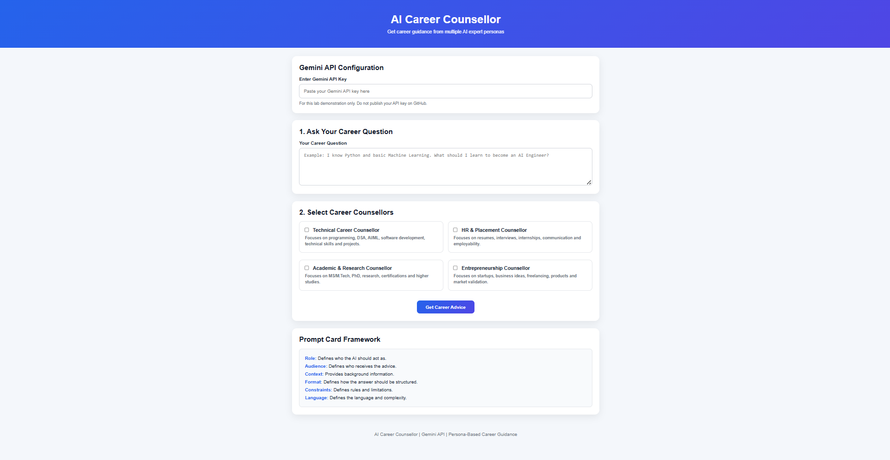
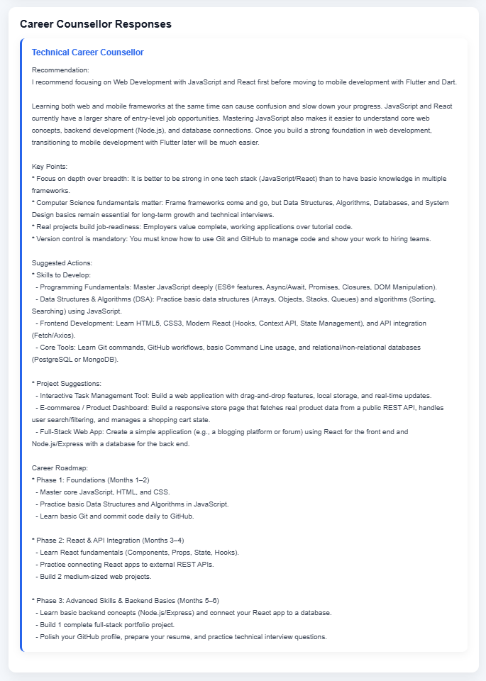
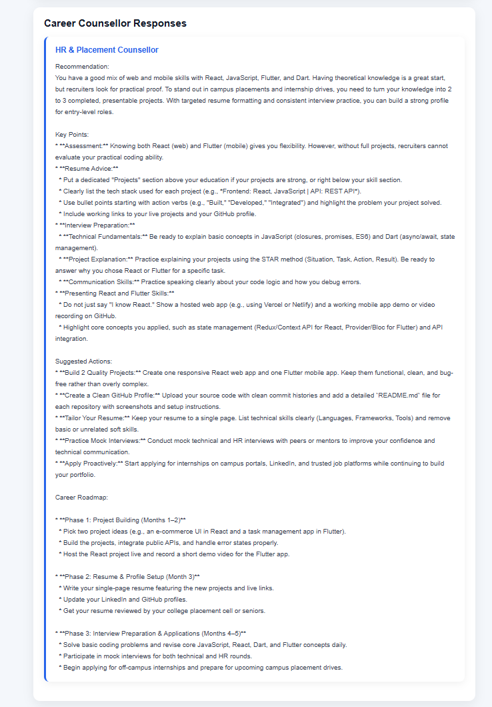
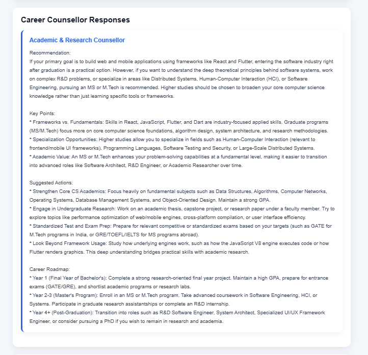
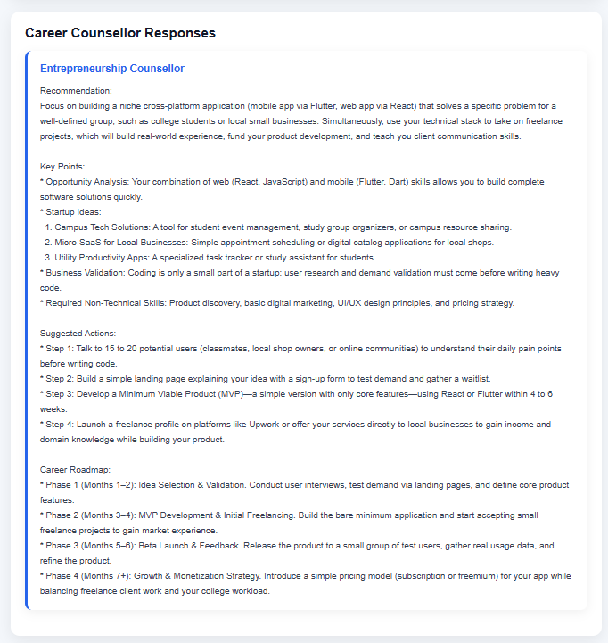

# 🤖 AI Career Counsellor

<div align="center">

## 🎓 AI-Powered Personalized Career Guidance

**A Gemini-powered career counselling application that provides personalized guidance from multiple specialized AI career counsellor personas.**

<br>


</div>

---

## 👨‍🎓 Student Information

| Detail | Information |
|---|---|
| **Name** | **Bhargav Limbani** |
| **Enrollment No.** | **92301733029** |
| **Project** | **AI Career Counsellor** |
| **Technology** | HTML, CSS, JavaScript, Gemini API |
| **Demo Video** | 🔗 **[https://drive.google.com/file/d/1qk47lxZliMiWVWMtfo3sHDSpBHv6h5ka/view?usp=sharing]** |
| **GitHub Repository** | 🔗 **[https://github.com/bhargavlimbani/AI-Career-Counsellor.git]** |

---

## 🌟 Project Overview

**AI Career Counsellor** is a web-based AI application designed to provide personalized career guidance to students.

The application uses the **Gemini API** to generate career advice based on the user's career question and the selected AI career counsellor persona.

Instead of giving the same type of advice for every question, the application provides different professional perspectives through specialized AI personas.

### 💡 Core Idea

> **One career question → Multiple professional perspectives → Better career decision-making**

For example, a student can ask:

> **"Should I prepare for placements or pursue higher studies?"**

The application can provide different perspectives from:

- 💻 Technical Career Counsellor
- 👔 HR & Placement Counsellor
- 🎓 Academic & Research Counsellor
- 🚀 Entrepreneurship Counsellor

---

## ✨ Key Features

### 👥 Multiple AI Personas

The application provides four specialized AI career counsellors.

| Persona | Primary Focus |
|---|---|
| 💻 **Technical Career Counsellor** | Programming, DSA, AI/ML, software development, technical skills and projects |
| 👔 **HR & Placement Counsellor** | Resumes, interviews, internships, communication and employability |
| 🎓 **Academic & Research Counsellor** | MS, M.Tech, PhD, research, certifications and higher studies |
| 🚀 **Entrepreneurship Counsellor** | Startups, freelancing, products, business ideas and market validation |

### 🧠 Persona-Based Prompting

Each counsellor uses a structured **Prompt Card** containing:

```text
Role
Audience
Context
Format
Constraints
Language
```

The selected persona information is combined with the user's question to create a specialized Gemini prompt.

### 🔀 Single & Multiple Persona Selection

Users can:

- Select one counsellor for focused advice.
- Select multiple counsellors for different perspectives.
- Compare the selected counsellors using the comparison table.

### 🤖 Gemini API Integration

The application sends the structured prompt to the **Google Gemini API** and displays the generated career guidance in the application.

### 🛡️ Input Validation & Error Handling

The application validates:

- Gemini API key
- Career question
- Persona selection

It also displays an error message when the API request fails.

### 📱 Responsive Design

The interface is designed to work on desktop and mobile-sized screens.

---

## 🧩 Prompt Card Framework

The application follows a structured prompt-card approach.

| Component | Purpose |
|---|---|
| **Role** | Defines who the AI should act as. |
| **Audience** | Defines who receives the advice. |
| **Context** | Provides background information about the student's career situation. |
| **Format** | Defines how the response should be structured. |
| **Constraints** | Defines rules, limitations and boundaries for the counsellor. |
| **Language** | Defines the language and complexity of the response. |

### Prompt Flow

```text
User Career Question
        ↓
Select Career Counsellor(s)
        ↓
Load Persona Prompt Card
        ↓
Role + Audience + Context
+ Format + Constraints + Language
        ↓
Structured Gemini Prompt
        ↓
Gemini API
        ↓
Persona-Specific Career Advice
        ↓
Display Results
        ↓
Compare Multiple Personas
```

---

## 🧑‍💼 Career Counsellor Personas

### 1. 💻 Technical Career Counsellor

**Focus:** Programming, DSA, AI/ML, software development, technical skills and projects.

**Typical guidance includes:**
- Programming skills
- Data Structures & Algorithms
- AI/ML learning
- Software development
- Technical projects
- Career roadmap

---

### 2. 👔 HR & Placement Counsellor

**Focus:** Resume, interviews, internships, recruitment and employability.

**Typical guidance includes:**
- Resume improvement
- Interview preparation
- Communication skills
- Internship preparation
- Placement strategy
- Employability skills

---

### 3. 🎓 Academic & Research Counsellor

**Focus:** Higher studies, MS/M.Tech, PhD, research and certifications.

**Typical guidance includes:**
- Higher-study options
- Research interests
- Academic preparation
- Certifications
- Entrance-exam preparation
- Research projects

---

### 4. 🚀 Entrepreneurship Counsellor

**Focus:** Startups, freelancing, products, business ideas and market validation.

**Typical guidance includes:**
- Startup ideas
- Product development
- Freelancing
- Business models
- Market validation
- Entrepreneurial skills

---

## 🛠️ Technologies Used

- **HTML5** — Application structure
- **CSS3** — Styling and responsive design
- **JavaScript** — Application logic and API integration
- **Google Gemini API** — AI-generated career guidance

No frontend framework or backend server is required for this lab implementation.

---

## 📁 Project Structure

```text
AI-Career-Counsellor/
│
├── index.html
├── README.md
├── Prompt-Card.pdf
│
└── assets/
    ├── home.png
    ├── technical.png
    ├── hr-placement.png
    ├── academic-research.png
    └── entrepreneurship.png
```

---

## 🚀 How to Run

### Step 1 — Download or Clone the Repository

```bash
git clone YOUR_GITHUB_REPOSITORY_URL
```

### Step 2 — Open the Project

Open the project folder in VS Code.

### Step 3 — Run the Application

Open:

```text
index.html
```

in a modern web browser.

You can also use the **Live Server** extension in VS Code.

### Step 4 — Enter Gemini API Key

Enter your Gemini API key in the API Key field.

> ⚠️ **Important:** Never publish your actual API key in this GitHub repository.

### Step 5 — Ask a Question

Enter a career-related question such as:

```text
I know Python and basic Machine Learning.
What should I learn to become an AI Engineer?
```

### Step 6 — Select Persona(s)

Select one or more career counsellors.

### Step 7 — Generate Advice

Click:

**Get Career Advice**

The application will generate persona-specific career guidance.

---

## 🧪 Testing

The application was tested using different career questions and different persona selections.

### Individual Persona Testing

- ✅ Technical Career Counsellor
- ✅ HR & Placement Counsellor
- ✅ Academic & Research Counsellor
- ✅ Entrepreneurship Counsellor

### Multiple Persona Testing

The application also supports selecting multiple counsellors for the same question.

Example:

```text
Question:
Should I prepare for placements or pursue higher studies?

Selected:
Technical + HR & Placement + Academic & Research
```

The application generates separate perspectives and displays a comparison table.

### Sample Questions

#### Question 1 — Software Development

```text
I want to become a software developer. What skills should I learn?
```

#### Question 2 — React

```text
I know HTML, CSS and JavaScript. Should I learn React to become a frontend developer?
```

#### Question 3 — Flutter & Dart

```text
I am learning Flutter and Dart. What should I learn next to become a mobile app developer?
```

#### Question 4 — Career Decision

```text
Should I prepare for campus placements or pursue higher studies?
```

---

## 📸 Screenshots

### 🏠 Application Interface



### 💻 Technical Career Counsellor



### 👔 HR & Placement Counsellor



### 🎓 Academic & Research Counsellor



### 🚀 Entrepreneurship Counsellor



---

## 📄 Prompt Card

The complete Prompt Card is included in:

```text
Prompt-Card.pdf
```

It contains the required:

```text
Role
Audience
Context
Format
Constraints
Language
```

for all four career counsellor personas.

---

## 🔐 API Key Security

The application accepts the Gemini API key at runtime.

**Do not commit or publish:**

```text
❌ Actual Gemini API key
❌ API credentials
❌ .env files containing secrets
❌ Private credentials
```

For the lab demonstration, enter the API key directly into the application's API Key field.

---

## 🎥 Demo Video

The demo video demonstrates:

1. Application interface
2. Available career counsellor personas
3. User career question
4. Individual persona selection
5. Generated AI response
6. Multiple persona selection
7. Multiple persona responses
8. Persona comparison
9. Prompt Card framework

**Demo Video:** https://drive.google.com/file/d/1qk47lxZliMiWVWMtfo3sHDSpBHv6h5ka/view?usp=sharing

---

## 🔗 GitHub Repository

**Repository:** https://github.com/bhargavlimbani/AI-Career-Counsellor.git

---

## 🎯 Project Objective

The objective of this project is to demonstrate how **persona-based prompting** can be used with the Gemini API to provide different AI-generated perspectives for the same career-related question.

The project demonstrates:

- AI API integration
- Structured prompt design
- Persona-based responses
- Multiple persona comparison
- Frontend development
- Input validation
- Error handling
- Responsive UI design

---

## 👨‍🎓 Student

**Bhargav Limbani**  
**Enrollment No.: 92301733029**

---

<div align="center">

### 🤖 AI Career Counsellor

**One Question • Multiple Perspectives • Better Career Decisions**

</div>
